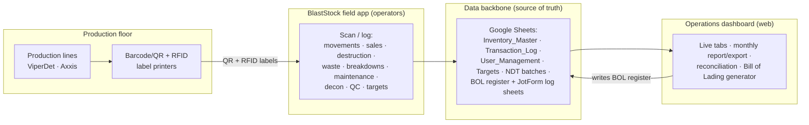

# Nairn Det Plant — Digital Operations Ecosystem

> **Purpose of this document.** A portable, self-contained summary of the end-to-end
> digital ecosystem built for the Nairn Detonator Plant (BME Mining Canada). It is
> written to be handed to another project/team (or an AI assistant) so they can
> understand the full scope of the work and reframe it into a report on its value.
> Everything below describes a working, deployed system — not a proposal.

---

## 1. Executive summary

Nairn Det Plant manufactures commercial explosives — **detonators** — a highly
regulated, high-consequence environment where every unit must be traceable from the
end of the production line through storage, sale, and (where required) destruction.

A single engineer designed and built a **complete digital operations ecosystem** for
the facility, spanning three layers:

1. **Automated capture at the source** — barcode/QR **and RFID** labelling wired into
   the end of each production line, so finished detonators are identified and tracked
   the moment they are made, with no manual data entry.
2. **A field application ("BlastStock")** operators use on the floor to log every
   inventory movement, sale, destruction, waste event, breakdown, maintenance action,
   decontamination, QC crimp check, and production target.
3. **A live operations dashboard** (deployed to the web, branded, password-gated,
   kitchen-TV ready) that turns all of that captured data into real-time visibility,
   monthly reporting, regulatory documents, and reconciliation/audit tooling.

The net result: **full cradle-to-grave traceability of explosive product**, automated
regulatory paperwork, and management visibility into throughput, efficiency, downtime,
and compliance — replacing what would otherwise be paper logs and spreadsheets.

---

## 2. Context

| | |
|---|---|
| **Facility** | Nairn Det Plant — detonator (initiating systems) manufacturing |
| **Operator** | BME (a subsidiary of the Omnia Group), Mining Canada |
| **Product lines** | **ViperDet** — non-electric detonators (shock-tube); **Axxis** — electronic programmable detonators |
| **Product families tracked** | ViperDet: *MS DUAL*, *QS*  ·  Axxis: *Titanium*, *Silver* |
| **Regulatory frame** | Dangerous Goods / TDG — Class 1.1B explosives, UN 0360 (non-electric) / UN 0511 (electronic), ERAP-covered |
| **Why traceability matters** | Legal chain-of-custody, magazine inventory control, shelf-life enforcement, safe destruction, and audit-ready sales documentation are mandatory, not optional |

---

## 3. The ecosystem at a glance

---

## 4. Component 1 — Automated capture at the source (printers + labelling)

Configured and integrated at the **end of each production line** so traceability is
automatic rather than manual:

- **QR/barcode labelling** of every finished-good box/tray as it comes off the line —
  each unit gets a unique identifier that keys every downstream record.
- **RFID labelling** for fast, contactless identification and stock-taking of
  finished goods.
- The identifier printed at the line is the **primary key** that follows the product
  through every subsequent event — movement, sale, destruction — giving an unbroken
  chain of custody.

This is the foundation that makes everything else possible: because identity is
captured automatically at manufacture, no downstream step depends on someone
remembering to write something down.

---

## 5. Component 2 — The BlastStock field application

The application operators use on the floor to record what happens to product and
equipment. It is the **write side** of the ecosystem and the origin of essentially
all operational data. Captured event types include:

- **Inventory movements between rooms** — every relocation (e.g. line → magazine,
  component room → line) is logged against the item's QR, building a full location
  history. Site rooms modelled include Magazines M1/M2, Sea Cans, Component Room,
  E-board Room, Warehouse Room 17, DAB-16A, NDT Room, and Maintenance stores.
- **Sales / dispatch** — a box's status moves to *Sold* against a **PO number** and
  customer, sending it off-site with full record of what left and to whom.
- **Destruction** — NDT batches are opened, their contents logged, sealed, and
  destroyed at T1; finished goods can also go directly to destruction. Every
  destruction is attributed to an operator with a timestamp.
- **Waste** — waste generated inside NDT batches is logged as it occurs.
- **Breakdowns** — line, station, nature (incl. *Critical Breakdown*), duration, and
  responsible personnel, per production line.
- **Maintenance & spares** — maintenance-room parts tracked as count-pools.
- **Decontamination** — equipment decon events (incl. HMX spill flagging).
- **QC crimp checks** — mid/inhole/outhole crimp measurements with pass/fail.
- **Production targets** — daily targets set per line for throughput tracking.
- **Operators & roster** — actions are attributed to named operators, enabling
  adoption and efficiency analysis.

---

## 6. Component 3 — The data backbone

A pragmatic, **zero-lock-in "source of truth"** layer built on Google Sheets, chosen
so the facility owns its data outright and the system could ship immediately without
standing up cloud infrastructure. Core datasets:

| Dataset | Role |
|---|---|
| `Inventory_Master` | Every labelled item: QR, description, product/delay/length, quantity, location, status, financial number, PO, production date, critical level |
| `Transaction_Log` | Immutable event stream: label creation, moves, quantity changes, status changes, sales, destructions, manual corrections — attributed and timestamped |
| `User_Management` | Operator roster (active/inactive) |
| `Daily_Targets` | Per-line daily production targets |
| `NDT_Batch_Contents` | Line-item contents of each destruction batch (+ waste) |
| BOL register | Immutable, sequentially-numbered Bill of Lading record (see §8) |
| JotForm-backed sheets | Breakdowns (ViperDet/Axxis), QC crimp checks, decontamination |
| Manufacturing reference | Manufacturable lengths + capability cheat-sheet data |

A thin, typed API layer abstracts this backbone so the front-end is identical whether
data is read directly from Sheets (CSV) or, later, from a hosted API — the backend can
be swapped without touching the UI (**"Sheets-now / AWS-later"**).

---

## 7. Component 4 — The operations dashboard (web app)

A branded, read-only web dashboard that turns the captured data into decisions. It is
**deployed and in production**, password-gated with two roles (full internal access; a
restricted "finished goods only" view for customers/buyers), and has a **kitchen-TV
mode** for large-format shop-floor display. Tabs:

- **Overview** — live daily-ops landing page: today's production vs target per line,
  shift-start deadtime, magazine movements, low-material alerts, QC and destruction status.
- **Monthly Report** — production totals by family, by day, and by product/length;
  shift-start deadtime trend; targets met; QC pass rate; breakdowns and downtime.
- **Monthly Export** — one-click **consolidated Markdown export** of every tab for a
  chosen month (production, operators, breakdowns/QC, destruction, sales, live inventory)
  — purpose-built as an input for downstream reporting.
- **Operators** — per-operator activity, efficiency and **system-adoption / misuse
  flags** (off-roster users, over-reliance on corrections, single-reason usage).
- **Breakdowns** — breakdown log, downtime, critical events, by-station analysis.
- **Finished Goods** — sellable stock pivot by location + **shelf-age alerts**
  (>12 months warning, >24 months = expired / cannot be sold).
- **Raw Materials** — raw-material stock pivot by location.
- **Financial Lookup** — totals for any financial number across every room (month-end).
- **Destruction & Waste** — awaiting-destruction queue, batches destroyed with
  click-through drill-down of contents, and a consolidated destruction summary.
- **Sales History** — sold boxes rolled up by PO number, customer, and volume.
- **Bill of Lading** — regulatory dispatch-document generator (see §8).
- **Filtered Inventory / Reconciliation / Maintenance Stores / Capabilities** —
  ad-hoc inventory search; **pool reconciliation** (sheet quantity vs transaction log,
  surfacing missed/incorrect scans); maintenance spares; and a printable capabilities
  reference.

---

## 8. Compliance tooling — Bill of Lading generator + audit register

A standout piece of regulatory automation. From the finished goods marked *Sold*, the
dashboard generates a **legally-formatted, TDG-compliant Bill of Lading** for dangerous
goods, including:

- Correct **UN numbers, hazard class (1.1B), packing group, and net explosive
  quantity/mass (NEQ/NEM)** derived automatically from the product type.
- **Placard and CANUTEC/ERAP** information.
- **Consignor/consignee, PO number, truck/trailer/driver**, and package/quantity totals.
- **Receiver signature capture** embedded on the printed document.

Every issued BOL is written to an **immutable, sequentially-numbered register**
(`BOL-YYYY-NNNN`, allocated with a lock to guarantee no duplicates), with full history
and reprint capability — i.e. an **audit-grade record** of every dangerous-goods
shipment that left the plant.

---

## 9. Technical architecture & stack

| Layer | Technology / approach |
|---|---|
| **Front-end** | Next.js (App Router, React, TypeScript), Tailwind CSS, Recharts, static export |
| **Hosting** | AWS S3 + CloudFront (Origin Access Control), custom domain via ACM + Route 53, Infrastructure-as-Code (CloudFormation), scripted build→deploy→invalidate |
| **Data read layer** | Typed API client with two interchangeable transports: direct Google Sheets CSV (browser) or Apps Script Web App (JSON) |
| **Data write layer** | Google Apps Script `doPost` with `LockService` for the sequential BOL register (single, controlled write-back) |
| **Field capture** | BlastStock app + line-side QR/barcode + RFID printing |
| **External logs** | JotForm-backed sheets for breakdowns, QC, and decontamination |
| **Access control** | Client-side role gate (full vs finished-goods-only), branded login, kitchen-TV mode |
| **Documents** | Browser print-to-PDF pipeline for the Bill of Lading; Markdown export for monthly reporting |

**Design principles:** vendor-neutral source of truth the facility fully owns; a clean
data boundary so the backend can migrate to a hosted database/API with no UI rewrite;
regulatory documents and audit trails treated as first-class, immutable records.

---

## 10. Value delivered

- **Traceability & compliance** — unbroken chain of custody for every explosive unit
  from line to destruction/sale; automated, audit-grade dangerous-goods documentation
  (BOLs) with a tamper-evident register; shelf-life enforcement on sellable stock.
- **Operational visibility** — real-time throughput vs target, shift-start deadtime and
  downtime, breakdown and QC trends, all on a shop-floor display.
- **Efficiency & accountability** — operator-level activity and efficiency metrics, plus
  data-quality flags that surface where the digital system isn't being used correctly.
- **Inventory integrity** — location-level stock pivots and automated reconciliation that
  catches discrepancies between physical counts and the logged transaction history.
- **Reduced manual effort** — automatic capture at the line and one-click monthly/regulatory
  outputs replace paper logs, manual spreadsheets, and hand-built reports.
- **Customer-facing transparency** — a restricted finished-goods view for buyers.
- **Pragmatic, low-cost delivery** — shipped on facility-owned Google Sheets with a clear,
  no-rework path to a scaled cloud backend.

---

## 11. Roadmap

- **Now:** Google Sheets as source of truth; static dashboard on AWS S3/CloudFront.
- **Next:** migrate the read/write layer to a hosted database + API behind the existing
  typed data boundary — no front-end changes required.

---

## 12. Specifics to fill in (author to complete)

*The dashboard/backbone/BOL detail above is verified from the codebase. The following
line-side/hardware specifics are best supplied by the author for an accurate report:*

- Exact **barcode/label printer** make/model and how it's triggered from the line.
- **RFID** hardware (tag type, reader/encoder) and read points.
- Whether the **BlastStock app** is mobile/handheld/desktop, its platform, and whether
  it was custom-built end-to-end or configured on an existing platform.
- Rough **timeline**, and any **before/after metrics** (e.g. time saved per shipment,
  reduction in reconciliation discrepancies, reporting time saved per month).
